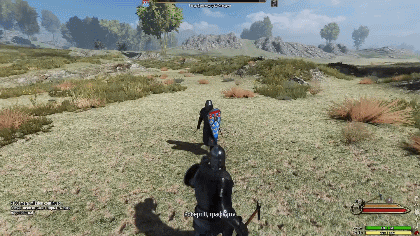
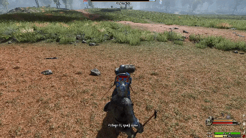
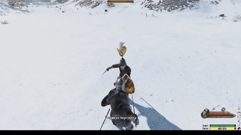

# Master Strikes

Feel the thrill of combat! This mod adds Kingdom Come: Deliverance-style master strikes, dodges, and clinches. Slip past blows, catch the right moment, and turn your block into a deadly counterattack.

## Core Features

**Master Strikes**

Block an enemy's attack and press the Master Strike key together with block. If the conditions are right, you will perform a cinematic counterattack that throws the enemy off balance.

**Dodges**

Hold the Dodge key and press A/S/D to dodge in any direction. Works with one-handed, two-handed, and other weapon types.

**Clinches**

Get close to an enemy and press the Clinch key to grab them and perform a cinematic close-quarters move. No extra buttons required.

## Additional Features

**Adrenaline Buff**

Perform 3 master strikes or clinches in a row to gain health, morale, and increased AI aggressiveness. Nearby allies gain morale; nearby enemies lose it.

**Stagger**

A master strike or clinch can, with a certain chance, knock the opponent off balance, causing them to perform a distinct stagger animation.

## Requirements

- [Harmony](https://www.nexusmods.com/mountandblade2bannerlord/mods/2006)
- [UIExtenderEx](https://www.nexusmods.com/mountandblade2bannerlord/mods/2102)
- [ButterLib](https://www.nexusmods.com/mountandblade2bannerlord/mods/2018)
- [MCM (Mod Configuration Menu)](https://www.nexusmods.com/mountandblade2bannerlord/mods/612)

Optional:
- [RBM (Realistic Battle Mod)](https://www.nexusmods.com/mountandblade2bannerlord/mods/791)

## Installation

1. Install Harmony, ButterLib, and MCM.
2. Download the latest version from [Nexus Mods](https://www.nexusmods.com/mountandblade2bannerlord/mods/12766).
3. Extract the `MasterStrikes` folder into your `Modules` directory.
4. Enable the mod in the launcher.

If you use RBM, also extract `MasterStrikes.RBM` and enable it after `MasterStrikes`.

## Configuration

All features can be toggled in the MCM settings menu:

- Enable or disable master strikes, dodges, and clinches individually.
- Adjust AI chance multipliers.
- Set skill thresholds for master strikes, clinches, and dodges.
- Bind controller buttons for all three mechanics.
- Toggle on-screen messages.

## Compatibility

- Game version: 1.4.5 – 1.4.8
- Tested with AD1259 (1.4.6+) and ROT (1.4.8)
- Compatible with RBM via the `MasterStrikes.RBM` submod

## License

MIT
